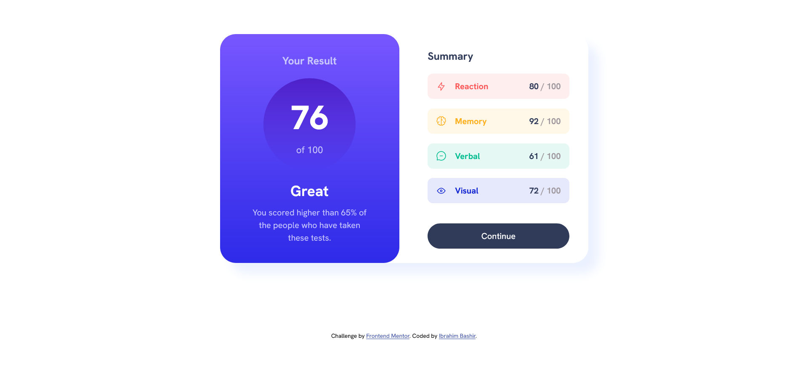

# Frontend Mentor - Results summary component solution

This is a solution to the [Results summary component challenge on Frontend Mentor](https://www.frontendmentor.io/challenges/results-summary-component-CE_K6s0maV). Frontend Mentor challenges help you improve your coding skills by building realistic projects. 

## Table of contents

- [Overview](#overview)
  - [The challenge](#the-challenge)
  - [Screenshot](#screenshot)
  - [Links](#links)
- [My process](#my-process)
  - [Built with](#built-with)
  - [What I learned](#what-i-learned)
- [Author](#author)

## Overview

### The challenge

Users should be able to:

- View the optimal layout for the interface depending on their device's screen size
- See hover and focus states for all interactive elements on the page

### Screenshot

### Links

- Solution URL: [https://github.com/ib-rim/results-summary-component](https://github.com/ib-rim/results-summary-component)
- Live Site URL: [https://ib-rim.github.io/results-summary-component/](https://ib-rim.github.io/results-summary-component/)

## My process

### Built with

- Semantic HTML5 markup
- CSS custom properties
- Flexbox
- CSS Grid
- Mobile-first workflow
- JSON data population

### What I learned

- Using place-items as a shorthand for justify-items and align-items
- Using CSS properties to save only the hsl values so that alpha values can still be adjusted
- Removing stroke from SVGs and using the stroke property to dynamically change the svg colors to match the text color

## Author

- Website - [Ibrahim Bashir](https://ib-rim.github.io)
- Frontend Mentor - [@ib-rim](https://www.frontendmentor.io/profile/ib-rim)
